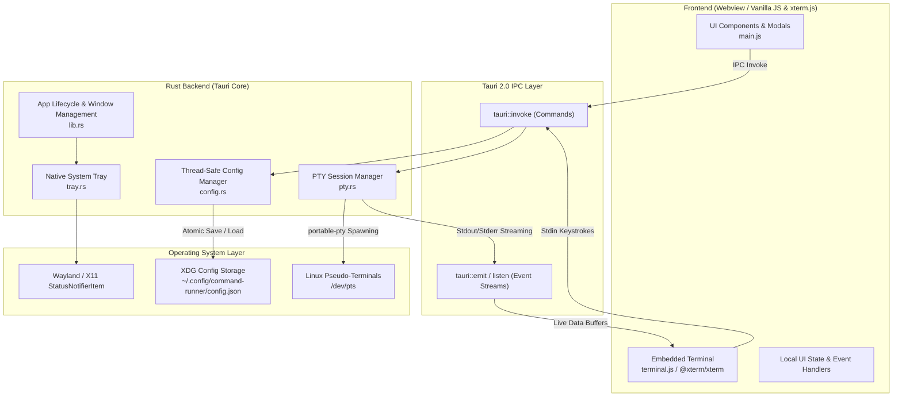

# Command Runner — System Architecture & Technical Design

This document details the software architecture, design patterns, threading model, IPC protocols, and security implementations of **Command Runner**.

---

## 1. Architectural Overview

Command Runner is built on a hybrid architecture combining a high-performance **Rust backend** (powered by Tauri 2.0 and `portable-pty`) with a modern, reactive **Webview frontend** (powered by Vanilla JavaScript, `xterm.js`, and Vite).



---

## 2. Directory & Module Structure

```
command-runner-rust/
├── index.html                   # Core application layout & dialog containers
├── package.json                 # Frontend dependencies (@xterm, @tauri-apps/api, vite)
├── vite.config.js               # Optimized Vite bundler configuration for Tauri
├── dist/                        # Compiled production frontend assets
├── src/                         # Frontend application source
│   ├── main.js                  # State orchestrator, IPC bridges, DOM event handlers
│   ├── terminal.js              # xterm.js lifecycle, FitAddon, PTY stream receiver
│   ├── dialogs.js               # Category emoji picker and dialog controllers
│   └── styles.css               # GNOME/Libadwaita dark theme design system
└── src-tauri/                   # Rust backend source
    ├── Cargo.toml               # Rust crates and release profile optimizations
    ├── tauri.conf.json          # Window geometry, capabilities, and tray config
    ├── capabilities/
    │   └── default.json         # Tauri 2.0 security capability permissions
    └── src/
        ├── main.rs              # Application entrypoint
        ├── lib.rs               # Command routing, state injection, window interceptors
        ├── config.rs            # Thread-safe config CRUD, atomic file IO, XDG compliance
        ├── pty.rs               # PTY session management, reader threads, process life cycle
        └── tray.rs              # Desktop system tray construction & event dispatching
```

---

## 3. Backend Subsystems

### A. Configuration Manager (`src-tauri/src/config.rs`)
- **State Storage**: Encapsulated in `Arc<parking_lot::RwLock<Vec<CommandItem>>>` injected into Tauri state.
- **XDG Compliance**: Automatically computes storage paths using `dirs::config_dir()`, defaulting to `$XDG_CONFIG_HOME/command-runner/config.json` (`~/.config/command-runner/config.json`).
- **Atomic Writes**: Config saves are written to `config.json.tmp` and then atomically renamed via `std::fs::rename`. This guarantees that unexpected crashes or power failures never corrupt the config file.
- **File System Permissions**: Enforces POSIX `0700` permissions on the configuration directory and `0600` on the JSON file, preventing unauthorized local users from reading command tokens or scripts.
- **Data Deduplication**: Import operations utilize UUID-based reconciliation to support merging exported configs without duplicating existing entries.

### B. PTY Subsystem & Process Engine (`src-tauri/src/pty.rs`)
- **PTY Allocation**: Employs `portable-pty::native_pty_system()` to provision real master/slave Linux pseudo-terminals (`/dev/pts`).
- **Session Lifecycle**:
  ```mermaid
  sequenceDiagram
      autonumber
      participant UI as Frontend (main.js)
      participant PTY as Backend (pty.rs)
      participant OS as Linux Subprocess (/bin/sh)
      participant EVT as Tauri Event Stream

      UI->>PTY: invoke("run_command", { id, command, ... })
      PTY->>OS: portable_pty::spawn(shell command)
      Note over PTY: Spawn dedicated Reader & Wait Threads
      loop Output Streaming
          OS-->>PTY: Master PTY bytes read
          PTY-->>EVT: emit("pty-output-{id}", UTF-8 / Raw Chunk)
          EVT-->>UI: xterm.write(data)
      end
      UI->>PTY: invoke("write_pty", { id, input })
      PTY->>OS: Master PTY write(input)
      OS->>PTY: Process Exits (Exit Code)
      PTY-->>EVT: emit("pty-exit-{id}", exitCode)
      PTY->>PTY: Cleanup session map & close file descriptors
  ```
- **Thread Model**:
  1. **Reader Thread**: Continuously reads from the master PTY descriptor in 4KB chunks and publishes Tauri events (`pty-output-{id}`) to the frontend.
  2. **Wait Thread**: Monitors child process termination without blocking the async runtime, captures the exit code, and emits `pty-exit-{id}`.
- **Interactive Control**: Keystrokes, terminal resize events (`resize_pty`), and interrupt signals (`stop_command` via `ChildKiller`) are routed immediately to the active PTY instance.

### C. Native System Tray (`src-tauri/src/tray.rs`)
- Implemented using Tauri 2.0 `TrayIconBuilder`.
- Supports desktop environments on both **Wayland** and **X11** via `libappindicator`/`StatusNotifierItem`.
- Intercepts window close requests (`tauri::WindowEvent::CloseRequested` in `lib.rs`) to hide the window to the tray rather than terminating the background processes.

---

## 4. Frontend Architecture

### A. Terminal Emulation (`src/terminal.js`)
- Uses **`@xterm/xterm`** along with `@xterm/addon-fit` and `@xterm/addon-web-links`.
- Auto-resizes using a DOM `ResizeObserver`, calculating `cols` and `rows` and dispatching `resize_pty` to the Rust backend to adjust the PTY geometry.
- Captures active buffer contents and supports exporting output directly to disk via `save_file`.

### B. State Management & Dynamic UI (`src/main.js`)
- **Card Categorization**: Dynamically computes categories and renders collapsible GNOME-styled accordions with emoji badges.
- **Search Engine**: Real-time filtering across command labels, shell commands, categories, and descriptions.
- **Template Variables**: Automatically scans command strings for `{{variable_name}}` patterns using regular expressions and renders dynamic input forms before triggering execution.
- **Drag & Drop**: Native HTML5 Drag and Drop API with immediate state reordering and synchronization to backend storage via `reorder_commands`.

---

## 5. Tauri IPC Interface (API Matrix)

| Command | Arguments | Returns | Description |
|---|---|---|---|
| `get_commands` | `()` | `Vec<CommandItem>` | Retrieves all saved commands from memory |
| `add_command` | `item: CommandItem` | `CommandItem` | Persists a new command with a generated UUID |
| `update_command` | `item: CommandItem` | `bool` | Updates existing command properties |
| `delete_command` | `id: String` | `bool` | Removes a command from storage |
| `duplicate_command` | `id: String` | `Option<CommandItem>` | Clones a command with `(copy)` suffix |
| `reorder_commands` | `ordered_ids: Vec<String>` | `()` | Updates card display order |
| `record_run` | `id: String, exit_code: i32` | `()` | Records last execution timestamp and exit status |
| `export_config` | `path: String` | `usize` | Exports all commands to a JSON file |
| `import_config` | `path: String, merge: bool` | `usize` | Imports commands from JSON (merge or replace) |
| `run_command` | `id, command, working_dir, env_vars, requires_sudo, global_sudo, cols, rows` | `()` | Allocates PTY and launches subprocess |
| `write_pty` | `id: String, data: String` | `()` | Sends user input / keystrokes to PTY stdin |
| `resize_pty` | `id: String, cols: u16, rows: u16` | `()` | Resizes active PTY dimensions |
| `stop_command` | `id: String` | `bool` | Sends kill signal to active subprocess |
| `check_command_running`| `id: String` | `bool` | Checks if a session is currently executing |
| `save_file` | `path: String, content: String` | `()` | Writes terminal output to file on disk |

---

## 6. Security & Safety Model

1. **Privilege Elevation Handling**:
   - Replaced legacy continuous background `sudo -v` polling with explicit on-demand elevation.
   - Per-command elevation dynamically wraps execution inside `pkexec sh -c '...'` or `sudo sh -c '...'` using single-quote escaping.
2. **Strict File Permissions**:
   - Configuration files are stored with POSIX `0600` (read/write only by owner) to prevent token leaks on multi-user systems.
3. **Robust Shell Tokenization**:
   - Environment variables are parsed using `shlex::split` with boundary checking to prevent command injection and parsing panic crashes.
4. **Sandboxed Webview**:
   - Tauri 2.0 capabilities restrict frontend capabilities exclusively to declared IPC endpoints with Content Security Policy enforcement.
