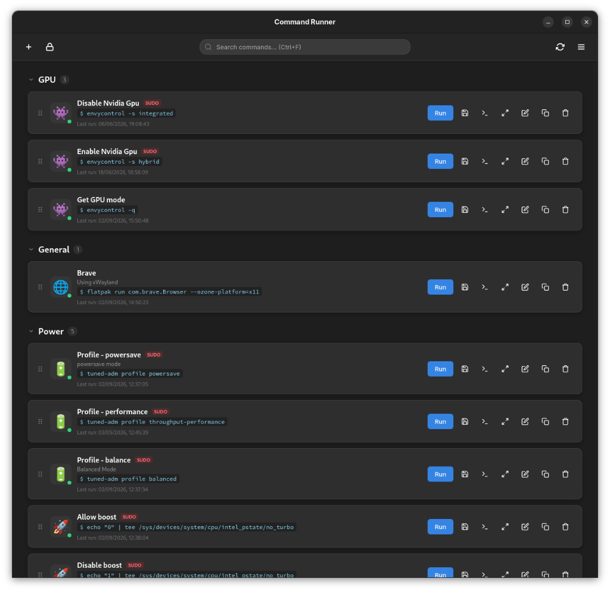
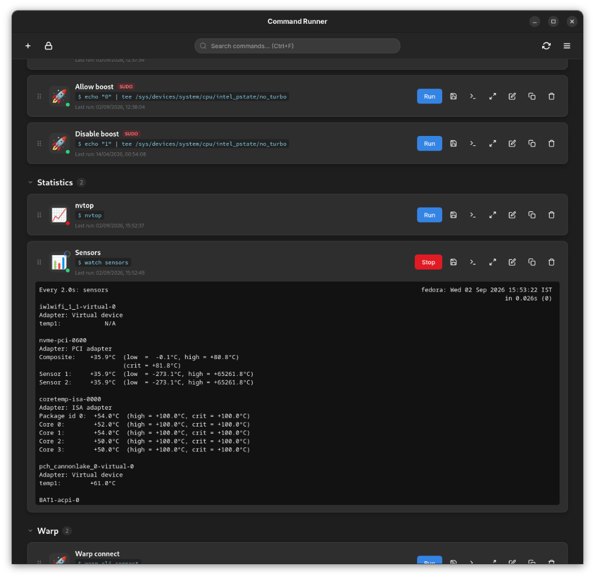
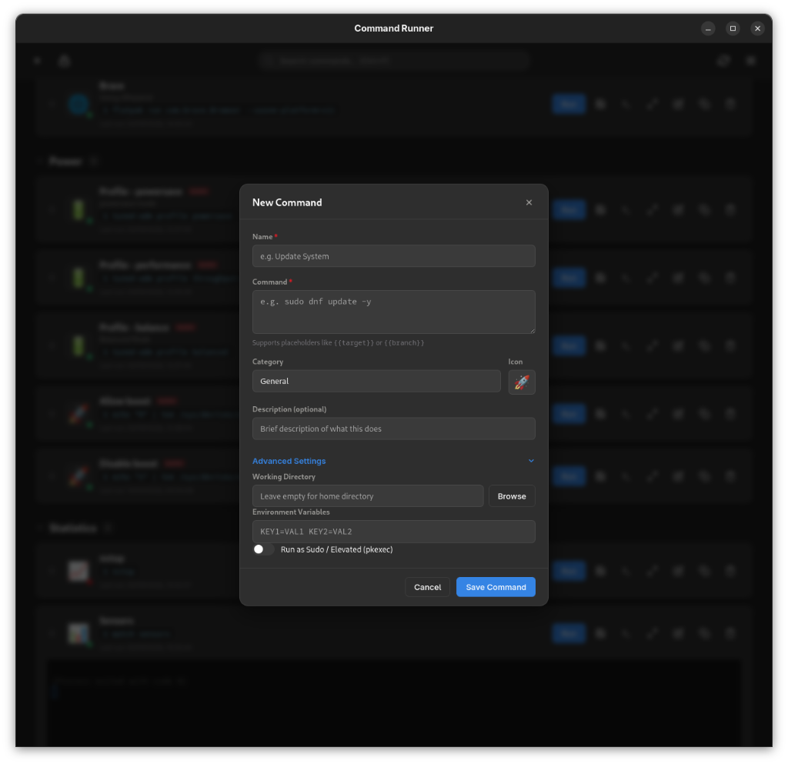

# Command Runner

A lightweight, high-performance desktop application for running, managing, and organizing terminal commands with custom template parameters, embedded terminal emulation, system tray integration, and elevated privileges.

Built with **Tauri 2.0**, **Rust**, and **xterm.js** to deliver zero C-library dependency friction, fast startup times, and minimal memory usage on any Linux distribution (Fedora, Ubuntu, Arch, Debian, openSUSE, etc.) and desktop environment (GNOME, KDE Plasma, XFCE, Sway, Hyprland).

---

## 📸 Screenshots

| Main Dashboard & Categories | Embedded Terminal Stream | New Command & Parameters |
|:---:|:---:|:---:|
|  |  |  |

---

## ✨ Features

- 🖥️ **Embedded xterm.js Terminal**: Full ANSI color support, real-time resizing, copy/paste, link detection, and terminal output export.
- ⚡ **True Pseudo-Terminal (PTY) Engine**: Built on Rust's `portable-pty` for direct Linux pseudo-terminal allocation (`/dev/pts`) and bidirectional streaming.
- 🧩 **Interactive Template Variables**: Define commands with `{{variable}}` placeholders (e.g. `ping {{host}}` or `git checkout {{branch}}`); Command Runner will prompt with a dedicated input form before running.
- 🔒 **Safe Privilege Elevation**: Per-command elevation or global sudo toggle supporting both `pkexec` (graphical authentication) and `sudo`.
- 🗂️ **Categories & Accordions**: Organize commands into collapsible category accordions with customizable emoji icons.
- 🔍 **Instant Search & Filter**: Real-time fuzzy filtering across command names, shell scripts, and descriptions with keyboard shortcuts (`Ctrl+F`).
- 🔄 **Drag-and-Drop Reordering**: Rearrange commands within and across categories with persistent ordering.
- 📥 **Config Import & Export**: Easily backup or share your command library via JSON with UUID-based duplicate merging.
-  tray **Native System Tray Integration**: Minimizes cleanly to the desktop status area (Wayland & X11) with quick toggle menus.
- 🛡️ **Secure by Design**: Atomic file saves, strict `0600` POSIX file permissions, and no continuous background sudo polling loops.

---

## 🏗️ Architecture

Command Runner decouples the user interface from low-level process execution via Tauri 2.0's type-safe IPC layer:

- **Frontend**: Vanilla JavaScript + `@xterm/xterm` + CSS3 design system themed with Libadwaita / GNOME dark tokens.
- **Backend (Rust)**: Tokio async runtime, `portable-pty` process subsystem, `parking_lot` RwLock state, and native tray bindings.

For complete architectural diagrams, threading models, and IPC API matrices, see **[ARCHITECTURE.md](ARCHITECTURE.md)**.

---

## 🚀 Getting Started

### Prerequisites

#### 1. System Dependencies (Linux)

- **Fedora / RHEL**:
  ```bash
  sudo dnf install webkit2gtk4.1-devel openssl-devel curl libappindicator-gtk3-devel
  ```
- **Ubuntu / Debian**:
  ```bash
  sudo apt install libwebkit2gtk-4.1-dev build-essential curl libssl-dev libayatana-appindicator3-dev
  ```
- **Arch Linux**:
  ```bash
  sudo pacman -S webkit2gtk-4.1 base-devel openssl libappindicator-gtk3
  ```

#### 2. Node.js & Rust
- Node.js (v18+) & `npm`
- Rust toolchain (`curl --proto '=https' --tlsv1.2 -sSf https://sh.rustup.rs | sh`)

---

### Installation & Development

1. **Clone the repository**:
   ```bash
   git clone https://github.com/sohamMl/command-runner-rust.git
   cd command-runner-rust
   ```

2. **Install frontend dependencies**:
   ```bash
   npm install
   ```

3. **Start the development server with live reload**:
   ```bash
   npm run tauri dev
   ```

---

## 📦 Building for Production

### 1. Standalone Release Binary
To compile an optimized, stripped standalone release binary:
```bash
npm run tauri build -- --no-bundle
```
The compiled binary will be located at:
```
src-tauri/target/release/command-runner
```

### 2. Native Package Bundles (`.rpm` / `.deb`)
To generate native Linux installation packages:
```bash
# Build both RPM and DEB packages
npm run tauri build -- --bundles deb,rpm

# Or build RPM only (Fedora)
npm run tauri build -- --bundles rpm

# Or build DEB only (Ubuntu/Debian)
npm run tauri build -- --bundles deb
```
Generated packages are placed in `src-tauri/target/release/bundle/`.

---

## ⚙️ Configuration & Storage

Command Runner stores all user data and commands in accordance with the XDG Base Directory specification:

- **Configuration File**: `$XDG_CONFIG_HOME/command-runner/config.json` (defaults to `~/.config/command-runner/config.json`).
- **File Permissions**: Automatically restricted to `0700` for the directory and `0600` for `config.json` to safeguard any sensitive tokens or commands.
- **Safety**: Configuration writes are atomic (`.tmp` file write followed by `fs::rename`) to prevent corruption during power cuts or abrupt exits.

---

## ⌨️ Shortcuts & Usage Tips

| Shortcut / Action | Function |
|---|---|
| `Ctrl + F` | Focus search bar to quickly filter commands |
| `Escape` | Close active modal / slide-over terminal |
| `Click on Tray Icon` | Toggle window visibility |
| `Close Window (X)` | Minimizes the app to the system tray |
| `{{param_name}}` | Injects an interactive parameter prompt when executing |

---

## 📄 License

This project is licensed under the [MIT License](LICENSE).
